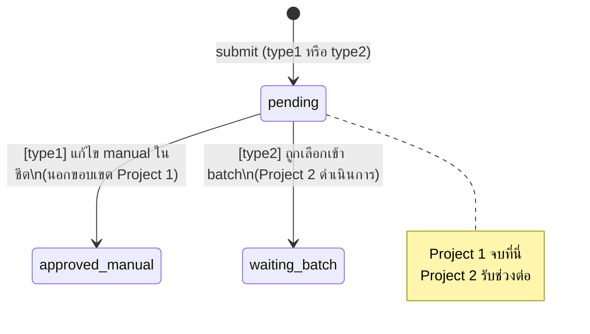

# PROJECT 1 — SmartBill: ระบบบันทึกใบกำกับภาษีอัจฉริยะ (Mobile App)
## Tech Spec v3.0 — แยกจาก TechSpec_AI_Smart_Billing_PettyCash_v3.md

> **ขอบเขตเอกสารนี้:** ครอบคลุมเฉพาะ **การบันทึกบิล** ผ่าน LINE LIFF บนมือถือ  
> (Project 2 ระบบอนุมัติวงเงินสดย่อย อยู่ในเอกสารแยกต่างหาก)

---

## 🗂️ สารบัญ

1. ภาพรวมและขอบเขต (Scope)
2. System Flow Diagram (Mermaid)
3. สถาปัตยกรรม (Architecture)
4. โครงสร้างไฟล์ (Project Structure)
5. Configuration
6. Data Model
7. Business Rules
8. Functional Spec — บันทึกบิล
9. Functional Spec — OCR (Gemini AI)
10. API Contract (เฉพาะ Project 1)
11. State Machine
12. Non-Functional Requirements
13. Email Spec (Backup รายวัน)
14. Appendix A — Prompt OCR
15. Appendix B — JSON Response Schema
16. Out of Scope (Project 1)
17. Integration Point กับ Project 2

---

## 1. ภาพรวมและขอบเขต (Scope)

**Project 1 ทำหน้าที่:**
- พนักงาน (ผู้เบิก) ถ่ายรูปบิล/ใบกำกับภาษีผ่านแอป LINE บนมือถือ
- ระบบ AI (Gemini) วิเคราะห์รูปและ auto-fill ฟอร์ม
- พนักงานตรวจสอบ/แก้ไขแล้วบันทึกลงระบบ
- ข้อมูลบันทึกลง Google Sheet (`TaxData`)
- มี 2 ประเภทการเบิก: **ประเภท 1** (ขอเบิกเงินคืน) และ **ประเภท 2** (ใช้วงเงินสดย่อย)

**ไม่รวมใน Project 1 (อยู่ใน Project 2):**
- การสร้างเอกสาร batch รวมบิล
- การอนุมัติโดยบัญชี
- การสร้าง PDF สรุป batch

**จุด Integration กับ Project 2:**
- คอลัมน์ `req_type` (U) และ `pettycash_batch_id` (V) ใน `TaxData` คือ interface ที่ Project 2 จะอ่าน
- Project 2 จะ query แถวที่ `req_type = "2"`, `status = "pending"`, `pettycash_batch_id` ว่าง

---

## 2. System Flow Diagram

```mermaid
flowchart TD
    A([👤 ผู้เบิก เปิด LINE App]) --> B[เปิด LIFF App\nindex.html]
    B --> C{liff.init()\nliff.getProfile()}
    C -- ไม่ได้ Login --> D[Redirect LINE Login]
    D --> C
    C -- Login แล้ว --> E[เรียก getUserProfile\nline_uid]

    E --> F{พบใน\nusers_profile?}
    F -- ไม่พบ / pettycash_control=NO --> G[ล็อก: ประเภท 1 เท่านั้น\nขอเบิกเงิน]
    F -- pettycash_control=YES --> H[แสดงตัวเลือก 2 ประเภท\ndefault = ประเภท 2]

    G --> I[เรียก getApprovers\nเติม dropdown]
    H --> I

    I --> J[ผู้ใช้ถ่าย/แนบรูปบิล]
    J --> K{AI Toggle\nเปิดอยู่?}

    K -- ปิด --> M[กรอกข้อมูลด้วยมือ]
    K -- เปิด --> L[เรียก OCR: action=analyze\nส่ง base64 ไป Gemini]
    L --> L1{Gemini\nตอบสำเร็จ?}
    L1 -- สำเร็จ --> L2[Auto-fill ฟอร์ม\ntaxId, sellerName, billDate\npreVat, vatAmount, expenseNote]
    L1 -- Error --> L3[แสดง AI Error\nผู้ใช้กรอกเองต่อได้]
    L2 --> M
    L3 --> M

    M --> N[ผู้ใช้ตรวจสอบ/แก้ไขข้อมูล\nทุกช่องแก้ไขได้]
    N --> N1{เลือก\nประเภทเบิก}
    N1 -- ประเภท 1 --> N2[เลือกผู้อนุมัติจาก dropdown]
    N1 -- ประเภท 2 --> N3[ระบบ set: เงินสดย่อยรอตัด\nautomatically readonly]

    N2 --> O[กดปุ่ม ยืนยันและบันทึก]
    N3 --> O

    O --> P[Validate ฝั่ง client\nRequired fields]
    P -- ไม่ผ่าน --> Q[แสดง Error\nให้แก้ไข]
    Q --> N
    P -- ผ่าน --> R[disable ปุ่ม submit\nอัปโหลดรูปไป Drive]

    R --> S[เรียก action=submit\nส่ง formData]

    S --> T[Backend: ตรวจสอบ\nคำนวณ totalAmount ซ้ำ\npreVat + vatAmount]
    T --> U[บันทึกลง TaxData\nStatus = pending]
    U --> V{อยู่ใน\nLINE Client?}
    V -- ใช่ --> W[liff.sendMessages\nส่งสรุปเข้าแชท LINE]
    V -- ไม่ --> X[แสดงข้อความ บันทึกสำเร็จ]
    W --> X
    X --> Y[ปิดหน้าต่างอัตโนมัติ\nหลัง 2 วินาที]

    style A fill:#4CAF50,color:#fff
    style Y fill:#4CAF50,color:#fff
    style Q fill:#f44336,color:#fff
    style L3 fill:#FF9800,color:#fff
```

---

## 3. สถาปัตยกรรม (Architecture)

```
┌─────────────────────┐        ┌───────────────────────────────────┐
│  LINE LIFF Client    │        │   Google Apps Script (Web App)     │
│  (1 หน้าจอ)          │  HTTP  │                                     │
│  index.html          │ POST  │  Main.gs  → doGet() / doPost()      │
│  บันทึกบิล            │──────▶│     ├─ Services/OcrService.gs      │
└─────────────────────┘        │     ├─ Services/BillService.gs     │
                                │     ├─ Services/UserService.gs     │
                                │     ├─ Services/ApproverService.gs │
                                │     ├─ Services/EmailService.gs    │
                                │     └─ Services/SheetRepo.gs       │
                                └───────────────┬─────────────────────┘
                                                │
                    ┌───────────────────────────┼───────────────┐
                    ▼                           ▼               ▼
          Google Sheet (DB)             Google Drive     Gemini API (OCR)
     TaxData / users_profile /        รูปบิล           วิเคราะห์รูปบิล→JSON
     Approve_users
                    │
                    ▼
             Gmail (MailApp)
     - Backup รายวัน (xlsx)
```

**หลักการสำคัญ:** ทุก Business Logic อยู่ฝั่ง Apps Script เท่านั้น ฝั่ง Client ทำหน้าที่แค่รับ input, เรียก API, แสดงผล

---

## 4. โครงสร้างไฟล์ (Project Structure)

### Backend — Google Apps Script

| ไฟล์ | หน้าที่ |
|---|---|
| `appsscript.json` | Manifest, timezone `Asia/Bangkok`, oauth scopes |
| `Config.gs` | อ่านค่า config ทั้งหมดจาก Script Properties (จุดเดียว) |
| `Main.gs` | `doGet(e)` และ `doPost(e)` — router เท่านั้น ห้ามใส่ business logic |
| `Services/OcrService.gs` | `analyzeInvoice(base64, contentType)` — เรียก Gemini API |
| `Services/BillService.gs` | `submitBill(formObject)` |
| `Services/UserService.gs` | `getUserProfile(lineUid)` |
| `Services/ApproverService.gs` | `getApproverList()` |
| `Services/EmailService.gs` | `sendDailyBackupEmail()` |
| `Services/SheetRepo.gs` | Helper กลาง: `getSheet`, `appendRow`, `findRowByValue`, `updateCell` |
| `Maintenance.gs` | `dailyMaintenance()` — trigger รายวัน |
| `Utils.gs` | Helper: format วันที่, แปลงชนิดข้อมูล, validate ตัวเลข |

### Frontend

| ไฟล์ | ใช้โดย | รายละเอียด |
|---|---|---|
| `index.html` | ผู้เบิกทุกคน | ฟอร์มบันทึกบิล + AI OCR |

---

## 5. Configuration (Script Properties)

| Key | ตัวอย่างค่า | คำอธิบาย |
|---|---|---|
| `SPREADSHEET_ID` | `1amztKC_QEVv9H7u6ubGCJYEHCHo0NWnJhT6ksNQCpnA` | **ห้ามเปลี่ยน** |
| `SHEET_TAXDATA` | `TaxData` | ชื่อแท็บข้อมูลบิล |
| `SHEET_APPROVE_USERS` | `Approve_users` | ชื่อแท็บผู้อนุมัติ |
| `SHEET_USERS_PROFILE` | `users_profile` | ชื่อแท็บสิทธิ์ผู้ใช้ |
| `DRIVE_FOLDER_ID_BILLS` | `1g6IiM2GUtwsI6vNJ2l0IMfgAjePGPGbs` | โฟลเดอร์รูปบิล (ใช้เดิม) |
| `GEMINI_API_KEY` | *(secret)* | **ต้องสร้างคีย์ใหม่** — คีย์เดิมถือว่าหลุดแล้ว |
| `GEMINI_MODEL` | `gemini-3.1-flash-lite` | ตรวจสอบชื่อรุ่น stable ล่าสุด ณ วันที่ deploy |
| `EMAIL_BACKUP_RECIPIENT` | `pingly69@outlook.com` | รับอีเมล backup รายวัน |
| `DAYS_TO_KEEP` | `14` | วันเก็บข้อมูลก่อนลบ |
| `LIFF_ID` | `2009016720-H0IBJAkd` | ยืนยันกับผู้ใช้ก่อนว่าใช้เดิมหรือสร้างใหม่ |

> **หมายเหตุ:** `LIFF_ID` และ `GAS_WEB_APP_URL` ให้ประกาศที่ต้นไฟล์ `index.html` เป็นตัวแปรเดียว ห้ามฝังซ้ำหลายจุด

---

## 6. Data Model

### 6.1 Sheet: `TaxData` — คอลัมน์ที่ Project 1 เขียน

> **ห้ามเปลี่ยนคอลัมน์ A–T เดิม** — ให้เพิ่มคอลัมน์ U, V ต่อท้ายเท่านั้น

| # | คอลัมน์ | ชนิดข้อมูล | ผู้กำหนด | คำอธิบาย |
|---|---|---|---|---|
| A | `Update_datetime` | Datetime | ระบบ (auto) | เวลาที่บันทึกแถว |
| B | `Tax_id` | String (prefix `'`) | ผู้ใช้/AI | เลขผู้เสียภาษี 13 หลัก |
| C | `Vend_name` | String | ผู้ใช้/AI | ชื่อผู้ขาย |
| D | `Branch_no` | String (prefix `'`) | ผู้ใช้/AI | รหัสสาขา 5 หลัก default `00000` |
| E | `Tax_docno` | String (prefix `'`) | ผู้ใช้/AI | เลขที่ใบกำกับภาษี |
| F | `doc_date` | String `dd/MM/yyyy` | ผู้ใช้/AI | วันที่บนบิล (รับ ISO แปลงก่อนเขียน) |
| G | `Amt` | Number(2) | ผู้ใช้/AI | **ยอดก่อน VAT** (ชื่อ `Amt` แต่ค่าคือ preVat) |
| H | `vat` | Number(2) | ผู้ใช้/AI | ยอด VAT (ถ้าไม่มี = `0.00`) |
| I | `Net` | Number(2) | ผู้ใช้/AI | **ยอดรวมสุทธิ** = Amt + vat |
| J | `Project` | String | ผู้ใช้ | รหัสโครงการ |
| K | `Remark` | String | AI (auto, แก้ไขได้) | สรุปรายการสินค้า |
| L | `Pic_bill` | String (URL) | ระบบ (auto) | ลิงก์รูปบิลใน Drive |
| M | `users_name` | String | ระบบ (auto) | LINE email หรือ `"LIFF User"` |
| N | `Request_Name` | String | ผู้ใช้ (prefill LINE displayName) | ชื่อ-นามสกุลผู้เบิก |
| O | `Line_UID` | String | ระบบ (auto) | LINE userId |
| P | `record_id` | String (prefix `'`) | ระบบ (auto) | `new Date().getTime()` — คีย์หลัก |
| Q | `approve_request` | String | ผู้ใช้ (type1) / ระบบ (type2) | ผู้อนุมัติที่เลือก |
| R | `approve_userid` | String | Manual (นอกระบบ) | ไม่มีหน้าจอบันทึกอัตโนมัติ |
| S | `approve_datetime` | Datetime | Manual (นอกระบบ) | เช่นเดียวกับ R |
| T | `status` | `pending`/`approved`/`rejected` | ระบบ | ค่าเริ่มต้น = `pending` เสมอ |
| **U** (ใหม่) | `req_type` | `"1"` หรือ `"2"` | ผู้ใช้ | ประเภทการเบิก (แถวเก่าที่ blank = ถือเป็น `"1"`) |
| **V** (ใหม่) | `pettycash_batch_id` | String (FK, prefix `'`) | ระบบ | Project 2 เขียน — Project 1 สร้างเว้นว่างไว้ |

### 6.2 Sheet: `users_profile` (อ่านอย่างเดียว — ไม่เขียน)

| คอลัมน์ | คำอธิบาย |
|---|---|
| `line_uid` | LINE userId (PK) |
| `Request_Name` | ชื่อผู้ใช้ (อ้างอิง, ไม่ใช้ prefill ฟอร์ม) |
| `emp_no` | รหัสพนักงาน |
| `pc.limit` | วงเงินสดย่อย (เก็บไว้, ไม่คำนวณรอบนี้) |
| `pettycash_control` | `YES`/`NO` — กำหนดว่าเห็นตัวเลือก type2 หรือไม่ |

> การเพิ่ม/แก้ไขผู้ใช้: แอดมินแก้ไขในชีตโดยตรง ไม่ต้องพัฒนาหน้าจอ CRUD

### 6.3 Sheet: `Approve_users` (อ่านอย่างเดียว — ไม่เขียน)

| คอลัมน์ | คำอธิบาย |
|---|---|
| `approve_request` | รายชื่อผู้อนุมัติสำหรับ dropdown (type1) |
| `line_profile` | ไม่ใช้งานในรอบนี้ |
| `line_uid` | ไม่ใช้งานในรอบนี้ |

> **สำคัญ:** `getApproverList()` ต้องกรองค่า `"เงินสดย่อยรอตัด"` ออกเสมอ ผู้ใช้ type1 ห้ามเลือกเองได้

---

## 7. Business Rules (Project 1)

**R1 — การเลือกประเภทเบิก (req_type)**
- โหลดฟอร์ม → เรียก `getUserProfile(line_uid)` เสมอ
- `Request_Name` prefill ด้วย LINE `displayName` **ทุกกรณี** แก้ไขได้เสมอ
- ไม่พบใน `users_profile` หรือ `pettycash_control = "NO"` → ล็อกเป็นประเภท 1 เท่านั้น
- `pettycash_control = "YES"` → แสดง 2 ตัวเลือก, **default = ประเภท 2**

**R2 — การกำหนดผู้อนุมัติอัตโนมัติ (approve_request)**
- `req_type = "1"` → ผู้ใช้เลือกจาก dropdown (กรอง `"เงินสดย่อยรอตัด"` ออก)
- `req_type = "2"` → ระบบ set `"เงินสดย่อยรอตัด"` อัตโนมัติ, UI แสดง readonly

**R3 — วงเงินคงเหลือ (ไม่คำนวณรอบนี้)**
- ไม่ต้องแสดง badge/ตัวเลขวงเงินคงเหลือ ทุกหน้า

**R10 — สิทธิ์ไฟล์ Drive**
- รูปบิลทุกไฟล์ต้องตั้ง `"Anyone with the link" (Viewer)` ทันทีหลังสร้าง

---

## 8. Functional Spec — บันทึกบิล (`index.html` + `submitBill`)

**UI ต้องมีฟิลด์ครบ:**
- ถ่าย/อัปโหลดรูป
- Toggle เปิด/ปิด AI Auto-Fill
- Tax ID, ชื่อผู้ขาย, เลขที่ใบกำกับ, สาขา (default `00000`), วันที่บิล
- ยอดก่อน VAT, VAT, ยอดรวม (readonly, คำนวณอัตโนมัติ)
- Project, ชื่อผู้เบิก (prefill+แก้ไขได้), ผู้อนุมัติ (dropdown/readonly ตาม type), หมายเหตุ
- **ใหม่:** ตัวเลือกประเภทการเบิก (R1)

**ขั้นตอนการทำงาน:**
1. เปิดหน้า → `liff.init()` → login → ดึง `liff.getProfile()`
2. เรียก `getUserProfile` → กำหนด default ประเภทตาม R1
3. เรียก `getApprovers` → เติม dropdown (กรองตาม R2)
4. ผู้ใช้ถ่าย/แนบรูป → ถ้า AI toggle เปิด → เรียก `analyze` → auto-fill → ผู้ใช้แก้ไขได้
5. กด "ยืนยันและบันทึก" → validate client → เรียก `submit`
6. **Backend คำนวณ `totalAmount = preVat + vatAmount` ซ้ำเสมอ** ห้ามเชื่อค่า client อย่างเดียว
7. บันทึกสำเร็จ → `liff.sendMessages` (ถ้าอยู่ใน LINE) → ปิดหน้าต่างหลัง 2 วินาที

**Field Mapping (payload → TaxData column):**

| Field ใน payload | คอลัมน์ใน TaxData |
|---|---|
| `taxId` | `Tax_id` |
| `sellerName` | `Vend_name` |
| `branchCode` | `Branch_no` |
| `billNumber` | `Tax_docno` |
| `billDate` (ISO `YYYY-MM-DD`) | `doc_date` (แปลงเป็น `dd/MM/yyyy` ก่อนเขียน) |
| `preVat` | `Amt` |
| `vatAmount` | `vat` |
| `totalAmount` (backend คำนวณซ้ำ) | `Net` |
| `projectCode` | `Project` |
| `expenseNote` | `Remark` |
| (ไฟล์รูป → อัปโหลด Drive) | `Pic_bill` |
| `lineEmail \|\| "LIFF User"` | `users_name` |
| `requesterName` | `Request_Name` |
| `lineUserId` | `Line_UID` |
| *(auto)* | `record_id` |
| `approve_request` | `approve_request` |
| *(ว่าง)* | `approve_userid`, `approve_datetime` |
| *(auto = `"pending"`)* | `status` |
| **`reqType`** | `req_type` |
| *(ว่างไว้ — Project 2 เขียน)* | `pettycash_batch_id` |

---

## 9. Functional Spec — OCR (Gemini AI)

- ใช้ Prompt ตาม **Appendix A ทุกตัวอักษร ห้ามแก้ logic**
- Config: `temperature: 0.1`, `responseMimeType: "application/json"`, บังคับ `responseSchema` ตาม Appendix B
- Error: ถ้า HTTP ≠ 200 → throw error → client แสดง `"AI Error: " + message` → ผู้ใช้กรอกเองต่อได้ ไม่บล็อก
- ค่าที่ AI คืน: `taxId, sellerName, branchCode, billNumber, billDate, preVat, vatAmount, expenseNote`

---

## 10. API Contract (Project 1)

ทุก request: `POST` ไป Web App URL, body `{ action: "...", ...payload }`, response `{ success: boolean, data?, message? }`

| action | payload | data (success) |
|---|---|---|
| `analyze` | `{ base64, type }` | `{ taxId, sellerName, branchCode, billNumber, billDate, preVat, vatAmount, expenseNote }` |
| `getApprovers` | `{}` | `["อนุมัติช่วยด้วย", ...]` (ไม่รวม `"เงินสดย่อยรอตัด"`) |
| `getUserProfile` | `{ lineUid }` | `{ found: boolean, pettycash_control, pc_limit, request_name, emp_no }` |
| `submit` | `{ formData: { ...field mapping..., reqType } }` | `"บันทึกสำเร็จ"` |

> ทุก action ที่เขียนข้อมูล (`submit`) ต้องใช้ `LockService.getScriptLock()` (รอสูงสุด 30 วินาที)

---

## 11. State Machine — `TaxData.status` (Project 1)



---

## 12. Non-Functional Requirements

- **Locking:** `submit` ต้องใช้ `LockService` ครอบการทำงาน
- **Idempotency:** ปุ่ม submit ต้อง disable ทันทีหลังกด — ไม่มี retry อัตโนมัติ
- **Security:** ห้าม hardcode API key/secret ใดๆ ใช้ Script Properties ทั้งหมด
- **Logging:** ทุก error ให้ `Logger.log()` พร้อม context (action, timestamp, message)
- **Timezone:** `Asia/Bangkok` (GMT+7) ทุกจุดที่ format วันที่/เวลา
- **ตัวเลขเงิน:** ทศนิยม 2 ตำแหน่งเสมอ

---

## 13. Email Spec — Backup รายวัน

| รายการ | ค่า |
|---|---|
| ผู้ส่ง | บัญชี Google ที่รัน Apps Script (MailApp) |
| ผู้รับ | `EMAIL_BACKUP_RECIPIENT` |
| ไฟล์แนบ | xlsx ของ TaxData จริง (ไม่ใช่ลิงก์) |
| ความถี่ | รายวัน (Trigger) |
| Purge | ลบแถวเก่ากว่า `DAYS_TO_KEEP` วัน ออกจาก TaxData |

---

## 14. Appendix A — Prompt OCR (ห้ามแก้ logic)

**System Instruction ที่ส่งให้ Gemini:**

```
คุณคือผู้เชี่ยวชาญด้านบัญชีไทยที่มีความแม่นยำระดับสูงสุดในการอ่านลายมือเขียนและเอกสารบิลใบเสร็จ ใบกำกับภาษีของไทย
กฎเหล็กและคำสั่งควบคุม (OCR Strict Logic):
1. การสกัดวันที่ (Date Extraction):
   - อ่านวันที่จากภาพตามที่ปรากฏ (เช่น "25/ม.ค./69")
   - หากพบชื่อเดือนภาษาไทย ให้แปลงเป็นตัวเลขเดือนตามเงื่อนไขนี้เสมอ:
     (ม.ค.=01, ก.พ.=02, มี.ค.=03, เม.ย.=04, พ.ค.=05, มิ.ย.=06, ก.ค.=07, ส.ค.=08, ก.ย.=09, ต.ค.=10, พ.ย.=11, ธ.ค.=12)
   - หากปีที่ปรากฏเป็น พ.ศ. (เช่น 69 หรือ 2569 หรือมากกว่าเลขนี้) ให้ลบด้วย 543 เพื่อแปลงเป็น ค.ศ. (เช่น 2026) หากเป็น ค.ศ. อยู่แล้ว ห้ามลบซ้ำ
   - ส่งกลับในรูปแบบ YYYY-MM-DD เท่านั้น
   - If confidence < 90%, default today or this month only.
2. กฎเรื่องภาษี (VAT & Calculations) สำคัญมาก:
   - ห้ามคำนวณ VAT เพิ่มเองเด็ดขาด (Don't calculate VAT yourself)
   - หากในบิลไม่มีบรรทัดที่ระบุภาษีมูลค่าเพิ่มหรือ VAT ให้ใส่ vatAmount = 0.00 ทันที
   - ในกรณีไม่มี VAT: ยอดรวม (totalAmount) ต้องเท่ากับยอดก่อน VAT (preVat)
   - หากเป็น "บิลเงินสด" ที่เขียนมือ มักจะไม่มี VAT ให้ตรวจสอบยอดรวมที่ระบุไว้เป็นหลัก
3. การจัดการความผิดพลาด:
   - หากลายมืออ่านยากหรือไม่ชัดเจน ให้พยายามเทียบเคียงจากบริบทของบิลใบอื่นในชุดข้อมูล หรือส่งค่าที่ใกล้เคียงที่สุดโดยไม่เดาสุ่ม
5. ตอบกลับเป็น JSON บริสุทธิ์เท่านั้น ห้ามมี Markdown หรือคำบรรยาย
6. ข้อมูลที่สกัดได้ต้องตรงตามโครงสร้างนี้:
{
  "taxId": "string (เลข 13 หลักของผู้ขาย)",
  "sellerName": "string (ชื่อบริษัทหรือร้านค้าผู้ขาย)",
  "branchCode": "string (5 หลัก เช่น 00000)",
  "billNumber": "string",
  "billDate": "YYYY-MM-DD",
  "preVat": number,
  "vatAmount": number,
  "totalAmount": number,
  "expenseNote": "string (สรุปจากรายการสินค้าในบิล)"
}
```

**User message:** `"สกัดข้อมูลบิลนี้เป็น JSON"`

**Generation Config:** `temperature: 0.1`, `responseMimeType: "application/json"`

---

## 15. Appendix B — JSON Response Schema

```json
{
  "type": "object",
  "properties": {
    "taxId": { "type": "string" },
    "sellerName": { "type": "string" },
    "branchCode": { "type": "string" },
    "billNumber": { "type": "string" },
    "billDate": { "type": "string" },
    "preVat": { "type": "number" },
    "vatAmount": { "type": "number" },
    "totalAmount": { "type": "number" },
    "expenseNote": { "type": "string" }
  },
  "required": ["taxId", "sellerName", "branchCode", "billNumber", "billDate", "preVat", "vatAmount", "totalAmount"]
}
```

---

## 16. Out of Scope (Project 1)

- การคำนวณ/แสดงวงเงินคงเหลือ real-time (→ Project 2 future)
- ระบบแจ้งเตือน LINE push (future)
- หน้าจอจัดการผู้ใช้/สิทธิ์ CRUD (→ แอดมินแก้ชีตโดยตรง)
- การสร้าง batch, PDF, อนุมัติ (→ **Project 2**)

---

## 17. Integration Point กับ Project 2

| จุดเชื่อม | รายละเอียด |
|---|---|
| **Google Sheet ร่วม** | `SPREADSHEET_ID` เดียวกัน `1amztKC_QEVv9H7u6ubGCJYEHCHo0NWnJhT6ksNQCpnA` |
| **ตาราง TaxData** | Project 1 เขียน; Project 2 อ่าน/อัปเดตคอลัมน์ V (`pettycash_batch_id`) และ T (`status`) |
| **เงื่อนไข query ของ Project 2** | `req_type = "2"` AND `status = "pending"` AND `pettycash_batch_id` ว่าง |
| **ตาราง users_profile** | ทั้งสอง project อ่านตารางนี้ร่วมกัน |
| **Drive Folder รูปบิล** | Project 2 ต้องอ่าน URL จาก `Pic_bill` เพื่อแนบใน PDF |
| **GAS Web App URL** | แนะนำให้ deploy เป็น Web App เดียวกัน (`doPost` router ต่างกันด้วย `action`) |
