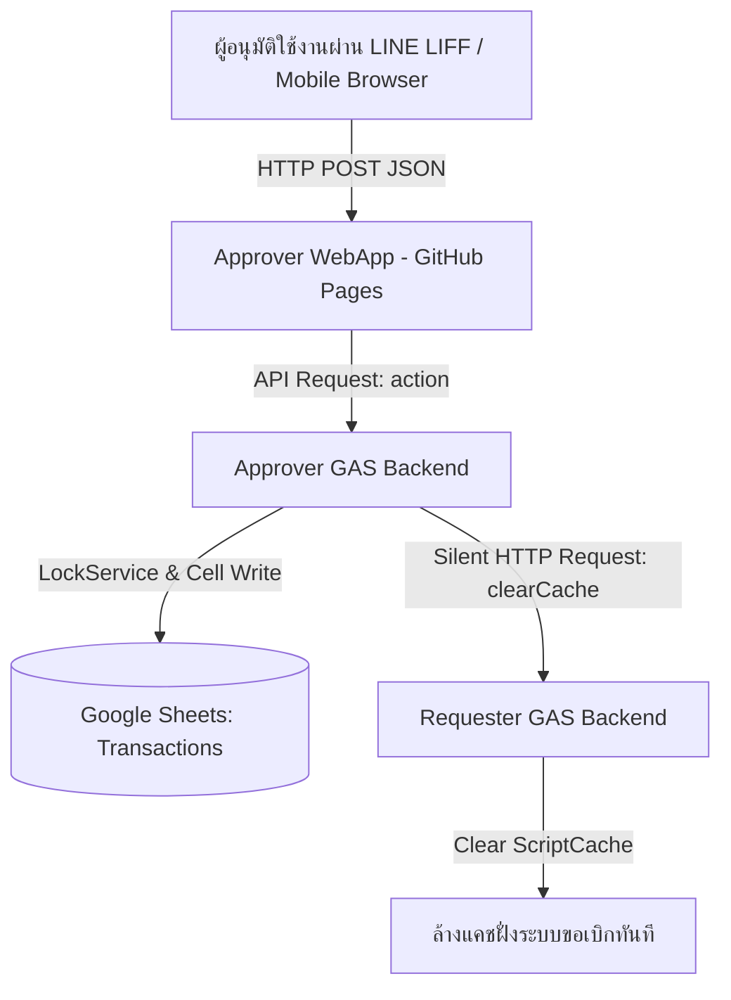

# 📖 คู่มือสถาปัตยกรรมและข้อมูลระบบอนุมัติ (Trip1Day Approver System Handbook)

**โปรเจกต์:** Trip1Day Approver Mobile Web App (ระบบอนุมัติค่าเดินทาง)  
**ตำแหน่งที่เกี่ยวข้อง:** System Architect (SA), Software Engineer, Database Administrator (DBA)  
**เวอร์ชันปัจจุบัน:** 2.0 (ปรับปรุงสถาปัตยกรรมและการโหลดประมวลผล 5 รายการเรียงตรงตาม Sheet)  
**วันที่อัปเดตล่าสุด:** 7 สิงหาคม 2026  

---

## 1. ภาพรวมระบบ (System Overview)

โปรเจกต์ **Trip1Day Approver** เป็นเว็บแอปพลิเคชันสำหรับ **"ผู้อนุมัติ (Approver)"** ซึ่งแยกพัฒนาเป็นโปรเจกต์อิสระ (คนละ GitHub Repository และคนละ Google Apps Script WebApp) จากระบบขอเบิกหลัก (Requester App) เพื่อแยกโหลดการทำงาน ป้องกันปัญหาคอขวด และเพิ่มความเร็วในการใช้งานสำหรับผู้บริหาร



---

## 2. โครงสร้างสถาปัตยกรรม (System Architecture & Tech Stack)

| ส่วนประกอบ | เทคโนโลยีที่ใช้ | รายละเอียดและตำแหน่งที่ตั้ง |
| :--- | :--- | :--- |
| **Frontend (หน้าบ้าน)** | Vanilla HTML5 / CSS3 / JavaScript (ES6) | โฮสต์บน **GitHub Pages** (`pingly69.github.io/trip1day_approve`) |
| **Backend (หลังบ้าน)** | Google Apps Script (V8 Engine) | Script ID: `1zwOxthQS8pa1JvHaLjAIOqTsQNi8mqmHeVE_MHuAB6Ik6zJTYXWIvzrK` |
| **Database (ฐานข้อมูล)** | Google Sheets (Shared Database) | ชีต `Transactions` และ `Approve_users` |
| **Authentication** | LINE LIFF SDK + Setup Code Fallback | LIFF ID: `2009016720-pVeqpTCP` |
| **Deployment Tools** | Custom Python Sync Script (`gas_sync.py`) | Push โค้ด + สร้าง Version ใน GAS อัตโนมัติ |

---

## 3. เงื่อนไขและกฎทางธุรกิจ (Business Rules & Workflows)

### 3.1. การโหลดข้อมูลรายการรออนุมัติ (`getPendingApprovals`)
1. **เรียงตามลำดับจริงใน Sheet (Top-to-Bottom)**: ดึงข้อมูลเรียงตรงจากบนลงล่างตามบรรทัดจริงใน Google Sheet **โดยไม่จัดเรียงวันเวลาย้อนกลับ (No Sorting)** เพื่อคงลำดับรายการและเพิ่มความเร็วในการประมวลผล
2. **ประมวลผลทีละ 5 รายการ (Batch Limit = 5)**: ดึงข้อมูลครั้งละไม่เกิน 5 รายการตามโควต้า `APPROVAL_BATCH_SIZE: 5`
3. **การตรวจสอบสิทธิ์ผู้อนุมัติ**: กรองข้อมูลเฉพาะแถวที่:
   - `Approver` (คอลัมน์ O) ตรงกับชื่อผู้อนุมัติ (ตัดช่องว่าง `.trim()` และไม่เคสตามอักษรตัวเล็กใหญ่)
   - `Status` (คอลัมน์ P) มีค่าเป็น `"PENDING"`
   - `Transaction_ID` (คอลัมน์ A) ต้องไม่เป็นค่าว่าง

### 3.2. การอนุมัติ / ปฏิเสธรายการ (`approveTransactions`)
1. **การประมวลผลแบบวนลูปชุดละ 5 รายการ (Batch Loop)**: เมื่อผู้อนุมัติเลือกรายการ (เช่น เลือก 12 รายการ) หน้าบ้านจะแบ่งเป็น Chunk ชุดละ 5 รายการ ยิงประมวลผลไปยัง Backend ทีละชุด จนครบทั้งหมดแล้ววนดึง 5 รายการ PENDING ถัดไปมาแสดงอัตโนมัติ
2. **การป้องกันข้อมูลชนกัน (LockService & Concurrency Control)**: ฝั่ง GAS จะเรียกใช้ `LockService.getScriptLock().tryLock(10000)` เพื่อล็อกสคริปต์ระหว่างบันทึกข้อมูล ป้องกันข้อมูลชนกันหากมีผู้อนุมัติอื่นกดพร้อมกัน
3. **การเขียนข้อมูลลง Sheet แบบเซลล์ต่อเซลล์ + Flush**: ค้นหาหมายเลขแถว (Row Index) ของรายการที่เลือก และใช้คำสั่งเขียนค่า `sheet.getRange(row, colStatus).setValue(status)` โดยตรง พร้อมสั่ง `SpreadsheetApp.flush()` ทันทีเพื่อความแม่นยำ 100%
4. **การสั่งล้างแคชข้ามระบบ (Cross-App Cache Clearing)**: หลังบันทึกสำเร็จ GAS ฝั่งอนุมัติจะยิงสั่งล้างแคชไปที่ระบบฝั่งผู้ขอเบิกหลักแบบเงียบๆ ผ่าน URL: `https://script.google.com/macros/s/AKfycbya3fPSmvww1tHK7HEV8FTp10RjKopFCKZ1M9ppCSDkGVAspWuKdsMfypL58ppj378k/exec`

---

## 4. โครงสร้างตารางข้อมูล (Google Sheets Schema)

ตารางหลัก `Transactions` ใน Google Sheets ประกอบด้วยคอลัมน์ A ถึง T ดังนี้:

| Index | ชื่อคอลัมน์ (Header Name) | ตัวอย่างข้อมูล | คำอธิบาย |
| :---: | :--- | :--- | :--- |
| **A (1)** | `Transaction_ID` | `TX-20260806-001` | รหัสอ้างอิงรายการ (ต้องไม่ซ้ำกัน) |
| **B (2)** | `Req_Name` | `นายสมชาย ใจดี` | ชื่อผู้ขอเบิกค่าเดินทาง |
| **C (3)** | `Req_LINE_UserId` | `U123456789...` | LINE UID ของผู้ขอเบิก |
| **D (4)** | `Req_Date` | `2026-08-06` | วันที่เดินทาง |
| **E (5)** | `Plate_No` | `กข 1234 กทม` | ทะเบียนรถ |
| **F (6)** | `Site_ID` | `ST-001` | รหัสสถานที่/หน่วยงาน |
| **G (7)** | `Site_Name` | `คลังสินค้าบางนา` | ชื่อสถานที่/หน่วยงาน |
| **H (8)** | `Travel_Purpose` | `ไปรับเอกสารลูกค้า` | วัตถุประสงค์การเดินทาง |
| **I (9)** | `Image_URL` | `https://...` | รูปภาพแนบ (ถ้ามี) |
| **J (10)** | `Total_KM` | `45` | ระยะทางรวม (กม.) |
| **K (11)** | `Toll_Fee` | `50` | ค่าทางด่วน (บาท) |
| **L (12)** | `Park_Fee` | `100` | ค่าที่จอดรถ (บาท) |
| **M (13)** | `Flat_Rate_Fee` | `150` | ค่าใช้รถเหมาจ่าย (บาท) |
| **N (14)** | `Net_Total` | `400` | ยอดเบิกสุทธิ (บาท) |
| **O (15)** | `Approver` | `พี่เสือ` | ชื่อผู้อนุมัติที่รับผิดชอบ |
| **P (16)** | `Status` | `PENDING` | สถานะ (`PENDING` / `APPROVED` / `REJECTED`) |
| **Q (17)** | `Approve_Datetime` | `2026-08-06 18:30:00` | วันเวลาที่อนุมัติ |
| **R (18)** | `Trip_Details` | `[{"trip_no":1...}]` | JSON รายละเอียดจุดเดินทางย่อย |
| **S (19)** | `Created_At` | `2026-08-06 10:00:00` | วันเวลาที่สร้างรายการ |
| **T (20)** | `Updated_At` | `2026-08-06 18:30:00` | วันเวลาที่อัปเดตล่าสุด |

---

## 5. ข้อมูลการเชื่อมต่อ API (GAS WebApp API Reference)

**Approver Backend WebApp URL:**  
`https://script.google.com/macros/s/AKfycbzgiozlTEfJcN9pSH9cYtIabYNy_J7DyjyE0P6tMB8rkki-7kPbslsFw2qHOB1G5BGIUg/exec`

### 5.1. Action: `login`
- **คำอธิบาย**: ตรวจสอบ LINE User ID หรือรหัสยืนยันตัวตน (Setup Code)
- **Request Payload**:
  ```json
  {
    "action": "login",
    "payload": {
      "lineUid": "U12345678...",
      "setupCode": "123456"
    }
  }
  ```
- **Response Success**:
  ```json
  {
    "status": "success",
    "data": {
      "isLoggedIn": true,
      "approverName": "พี่เสือ"
    }
  }
  ```

### 5.2. Action: `getPendingApprovals`
- **คำอธิบาย**: ดึงรายการค้างอนุมัติเรียงจากบนลงล่างของผู้อนุมัติ (จำกัด 5 รายการ)
- **Request Payload**:
  ```json
  {
    "action": "getPendingApprovals",
    "payload": {
      "approverName": "พี่เสือ",
      "offset": 0,
      "limit": 5
    }
  }
  ```

### 5.3. Action: `approveTransactions`
- **คำอธิบาย**: อนุมัติหรือปฏิเสธรายการชุดละไม่เกิน 5 รายการ
- **Request Payload**:
  ```json
  {
    "action": "approveTransactions",
    "payload": {
      "transactionIds": ["TX-001", "TX-002"],
      "approverName": "พี่เสือ",
      "status": "APPROVED"
    }
  }
  ```

---

## 6. สถาปัตยกรรมหน้าบ้านและการล้างแคช (Frontend & Cache Strategy)

1. **SVG Icons แทน Emoji**: ใช้ไอคอน SVG แบบ Inline ทั้งหมดในการแสดงผล เพื่อป้องกันปัญหาสัญลักษณ์รูปกล่องสี่เหลี่ยมกากบาท `☒` บนมือถือและเบราว์เซอร์เก่า
2. **การเข้าสู่ระบบบนคอมพิวเตอร์ (Notebook / Desktop)**: หากเปิดลิงก์บนเบราว์เซอร์คอมพิวเตอร์ ระบบจะเรียก `liff.login({ redirectUri: window.location.href })` เด้งไปหน้า **LINE Login สีเขียว** เพื่อให้ล็อกอินด้วยบัญชี LINE จริงได้อย่างราบรื่น
3. **การป้องกัน CDN Cache (Version Buster)**: หน้า `index.html` จะทำการระบุตัวแปรเวอร์ชันท้ายไฟล์สคริปต์ `<script src="app.js?v=20260807_v12"></script>` พร้อมใส่ Meta Header `no-cache` เพื่อบังคับล้างแคชในเบราว์เซอร์และ GitHub Pages CDN ทุกครั้งที่มีการอัปเดต

---

## 7. เครื่องมือและการ Deploy (Deployment & Sync Tooling)

โปรเจกต์นี้มีสคริปต์ `gas_sync.py` สำหรับช่วยในการอัปเดตระบบไปยัง Google Apps Script โดยอัตโนมัติ:

```bash
# คำสั่ง Push โค้ด Backend ไปยัง Google Apps Script
python gas_sync.py push
```

**กระบวนการอัตโนมัติของ `gas_sync.py push`:**
1. อัปโหลดไฟล์ `.js` และ `appsscript.json` ไปยัง Google Apps Script Editor
2. เรียกใช้ Google Script API เพื่อสั่ง **สร้าง Version ใหม่ (Create New Version Number)** โดยอัตโนมัติ
3. ทำการ **Re-bind WebApp Deployment** ให้ชี้ไปที่ Version ล่าสุดทันที ทำให้ WebApp URL ทำงานตามโค้ดใหม่ 100% โดยไม่ต้องเปิดหน้าต่างกดใน GAS Editor
4. สั่ง `git push` เพื่ออัปเดตไฟล์หน้าบ้านขึ้น GitHub Pages

---

## 8. สรุปไฟล์ในโปรเจกต์ (File Inventory)

- **`index.html`**: โครงสร้าง UI หน้าจออนุมัติ (Mobile-First Card Layout)
- **`styles.css`**: ชุดตกแต่ง UI แบบกระจ่าง ชัดเจน คอนทราสต์สูง อ่านง่ายบนมือถือ
- **`app.js`**: สคริปต์หลักฝั่ง Frontend (การต่อ LIFF, Render Card, Parsing Trip JSON, Batch Approval)
- **`Admin_Api.js`**: จุดรับส่ง Request (Router) ของ GAS Backend
- **`Admin_Service.js`**: Business Logic และการตรวจสอบสิทธิ์ฝั่ง GAS Backend
- **`Admin_Repository.js`**: Data Access Layer สำหรับอ่าน/เขียน Google Sheet `Transactions`
- **`Config.js`**: ไฟล์ตั้งค่า Header, Batch Size (5), และ URL การล้างแคช
- **`gas_sync.py`**: เครื่องมือ Deployment อัตโนมัติ
